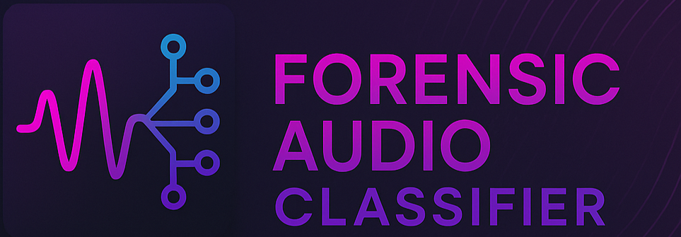

<!-- ===================== PROJECT BANNER ===================== -->

  

<!-- ===================== PROJECT LOGO ===================== -->

  

<!-- ===================== PROJECT TITLE ===================== -->

<h1 align="center">🛡️ Forensic Audio Classifier Tool</h1>

  <b>Hybrid AM + LM + Classifier Based Crime Speech Detection System</b> 
  <i>Optimized for Tripura Bengali Dialect</i>

<!-- ===================== BADGES ===================== -->

  
  
  
  

 

## 👤 Developer Information

**Developer:** Arnab Das  
**Institute:** NFSU Tripura Campus  
**Year:** 2025  

## 📌 Overview

The **Forensic Audio Classifier Tool** is a machine-learning based forensic audio analysis system designed to transcribe, analyze, and classify speech content in **Tripura’s Bengali dialect**, influenced by:

- Comilla
- Dhaka
- Noakhali
- Sylhet
- Bengali (Local)

The tool automatically categorizes audio evidence into:

- 🚨 **Flagged** — Crime-related audio  
- 🧐 **Review** — Ambiguous or partially suspicious  
- ✅ **Safe** — Harmless speech  
